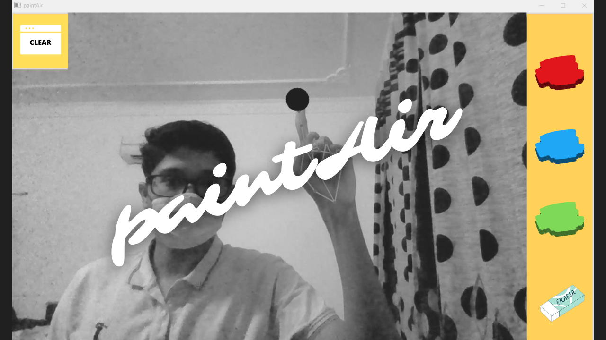

#  paintAir



> Wanna doodle in the Air? You're at the right place!     

----

### Table of Contents

- [Description](#description)
- [Demo](#demo)
- [How To Use](#how-to-use)

----


## Description

A virtual painter to draw using hand-gestures. It uses a custom hand-tracking module implemented with the MediaPipe library to detect hand-gestures and OpenCV to combine the drawing to the web-cam feed.

### Features

- Multi-color support.
- Pixel-wise erasing and clear-all functionality.

[Back To The Top](#paintair)

---


## Demo

#### Tool Selection

In the "Selection Mode", move the hand such that the pointer formed by the first two fingers hovers over the icon of the required tool. The selected tool will be highlighted accordingly.


#### Drawing

In the "Editing Mode", use the tip of the index finger to make the desired strokes. 


#### Erasing

##### Pixel-wise erasing

- Enter the "Selection Mode". 
- Choose the "Eraser" tool from the menu-bar as shown above. 
- Enter the "Editing Mode". 
- Use the tip of the index finger to erase the required region. 


##### Clear-All

In the "Selection Mode", hover over the "Clear-All" icon in the top-left corner. 


[Back To The Top](#paintair)

---


## How To Use

#### Installation (Windows)
> Ensure that your python version is between 3.6-3.8 as MediaPipe doesn't support other python versions.

- Clone the repo : ```git clone https://github.com/akash-sr/paintAir.git```
- Change the current working directory to the project directory.
- Create a virtual environment : ```python -m venv venv```
- Activate the virtual environment : ```venv\Scripts\activate```
- Install dependencies : ```pip install -r requirements.txt```
- Run the app : ```py -3.6 -m paintAir.py``` (Since I had multiple versions of Python installed on my system, I've explicitly used ```"py -3.6"``` instead of ```"python"```)
- Start Doodling !

[Back To The Top](#paintair)

---

#### To Do

- [x] Clear-All functionality.
- [ ] Geometric shapes.
- [ ] Dynamic thickness. 

